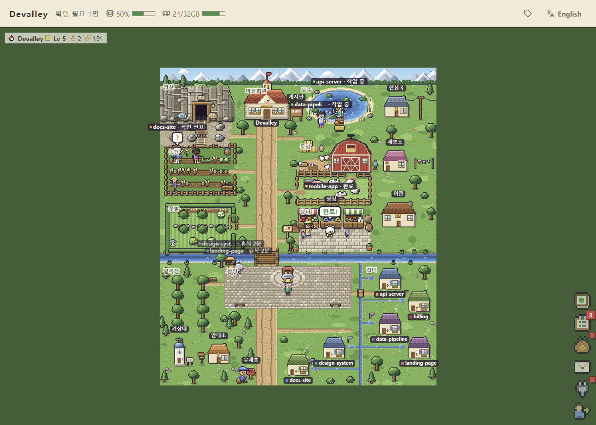
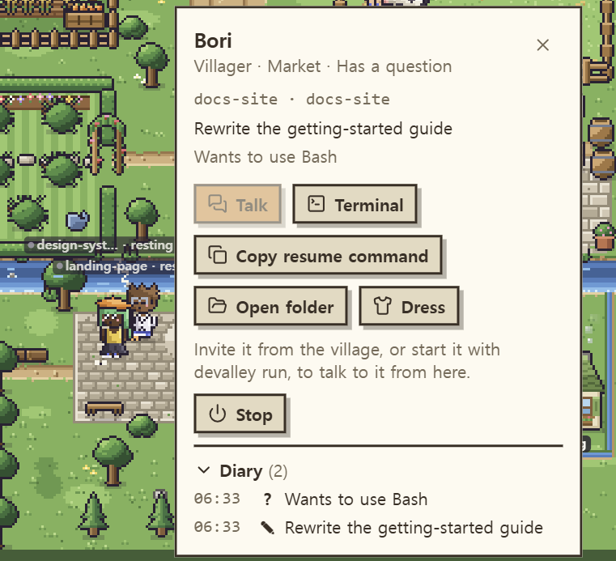
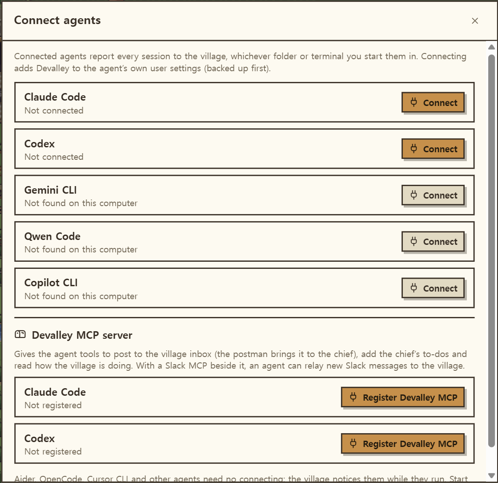
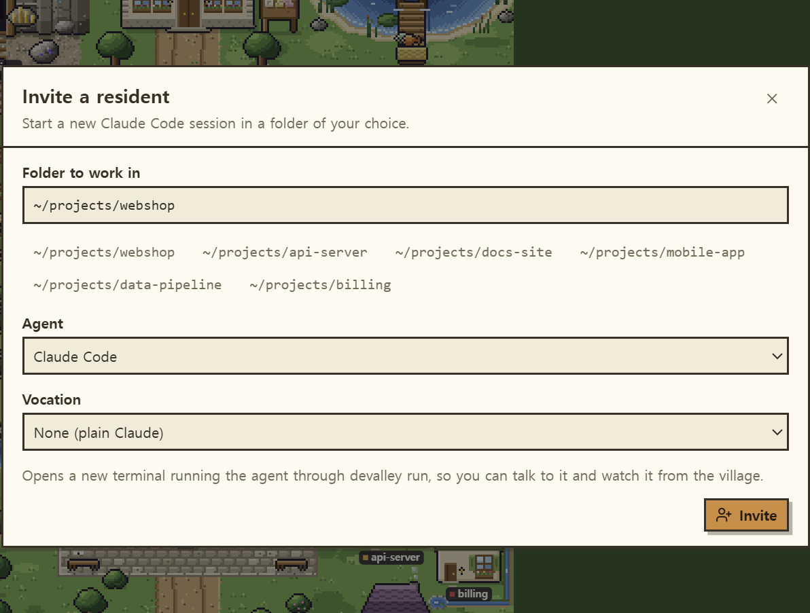
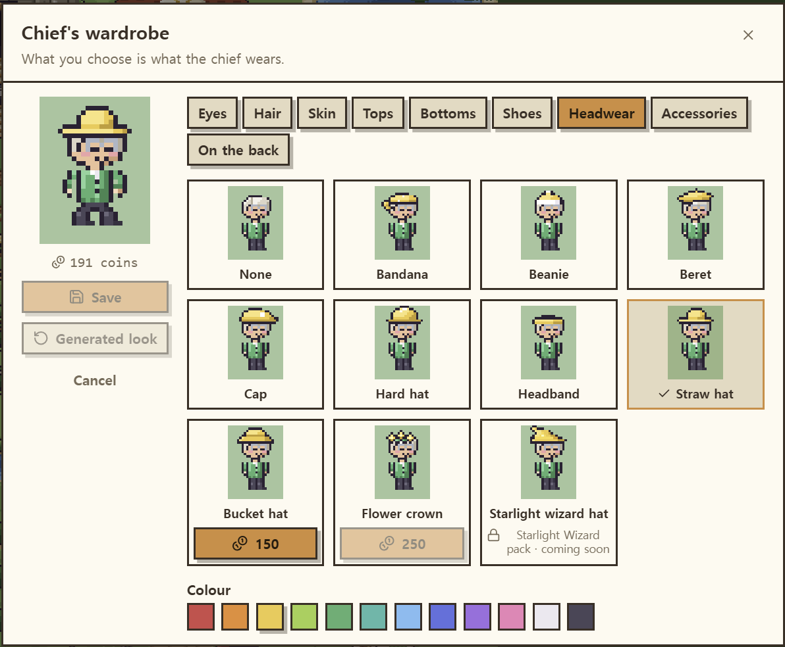
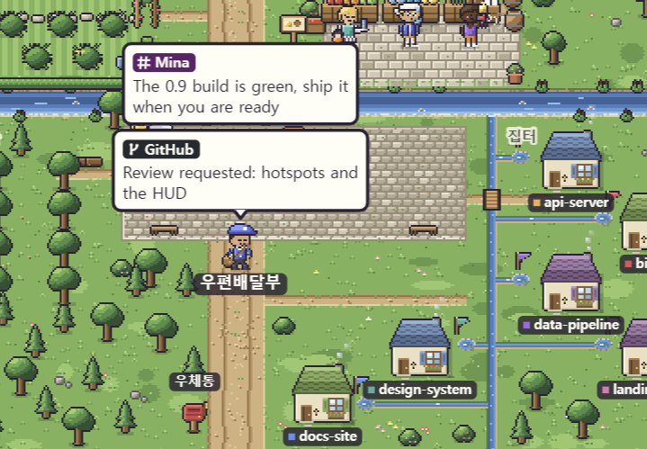
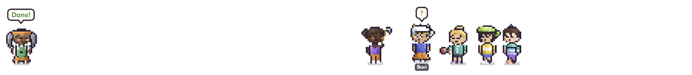
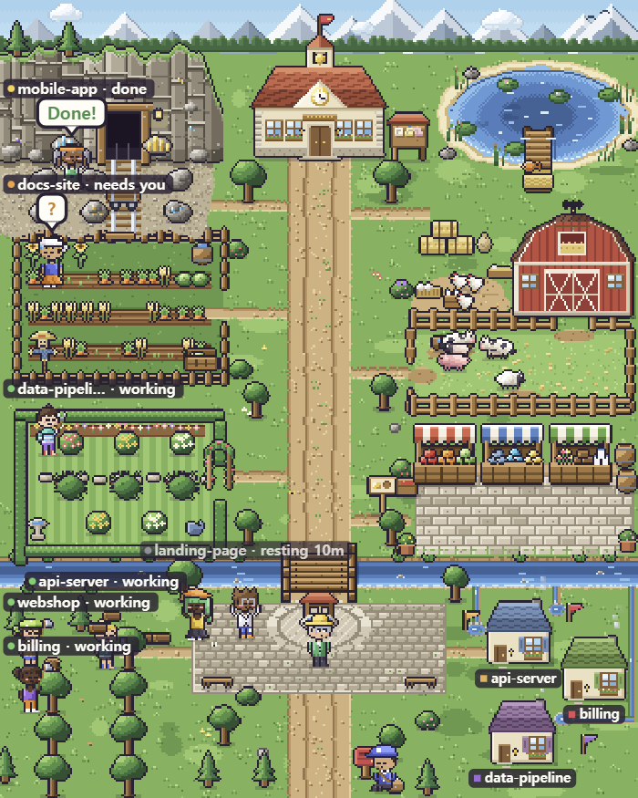

# Devalley

A pixel-art village where every coding-agent session is a resident: Claude Code, Codex, Gemini CLI, Qwen Code, Copilot CLI, Aider, OpenCode and more. It works with them in any folder and any terminal, IDE or ADE: iTerm, Windows Terminal, PowerShell, the VS Code or Cursor terminal, or a tool that launches the agent for you.

- **Residents show what their agent is doing.** Working sessions go to work at the farm, mine, lake, ranch, garden, market or lumberyard, and the valley changes as they work: trees fall and grow back, rocks break, fish are landed, crops ripen and are harvested. A question or permission prompt raises a **?** bubble, and a finished turn cheers **Done!**
- **Each agent in each project is one resident,** with the same name and look every session. About one in four is born a small round critter (a cub, bunny, kitty, chick, pup, hamster or frog). Dress them in the wardrobe, and the chief too.
- **Repositories and branches become cottages** on streams off the main river.
- **Messages from outside reach the village.** The postman brings Slack, GitHub or any other message to the chief as a speech bubble.
- **The chief keeps your to-dos** on the notice board by the town hall.
- **Play as the chief:** walk the chief around the village with the arrow keys, and press Space at any workplace to lend a hand. Every few swings earn a coin or a few, shown over the chief's head, to spend in the shop and the wardrobe.
- **A village journal** fills a square for every day you work, like GitHub's contribution graph. It earns XP, levels and coins, and the coins buy decorations for the valley and clothes for its residents.



> Status: early development. The village speaks English and Korean; switch in the header.

## Download

Get the installer for your system from the **[Releases](https://github.com/dongdongdongdongding/devalley/releases)** page:

- **Windows:** `Devalley-…-win-x64-setup.exe` to install, or `…-portable.exe` to run without installing. The app isn't code-signed yet, so the first launch shows SmartScreen: choose **More info**, then **Run anyway**.
- **macOS:** the `.dmg` for Apple silicon (`arm64`) or Intel (`x64`). Drag Devalley to Applications, and the first time, right-click it and choose **Open**.

Installing a new version over an old one closes the running app first. The tray menu shows the version you have and links to **Get the latest version…**.

The first time, the village asks to **Connect Claude Code**. Sessions that are already running join on their next prompt, with no restart; new ones move in as soon as you send them a prompt.

Click a resident to see its task, copy the `claude --resume` command for its session, or open its folder. Click a finished resident to mark its work as seen. The notice board by the town hall opens the journal, the shop and your to-dos.

Each resident keeps a **diary** on its card: what you asked it, what it asked you, and how each turn ended (the first line of its last answer, or the error it stopped on), newest first.



## Other agents

Devalley follows other agent CLIs the same way, from every folder and terminal:

| Agent | How it joins the village |
| --- | --- |
| Claude Code | Connected in **Connect agents** |
| Codex | Connected the same way, including Codex started from Orca's terminals |
| Gemini CLI | Connected the same way |
| Qwen Code | Connected the same way |
| Copilot CLI | Connected the same way |
| Aider, OpenCode, Cursor CLI, any other | Seen running on your computer; invited, its terminal too |



Open **Connect agents** from the village header, the chief's card or the tray menu. Each connection goes into that agent's own user-level settings, with a dated backup next to them, so it applies wherever you start it. It never prints anything or gets in the agent's way.

Sessions of any agent move in even without a connection, or before their first prompt: Devalley notices them running and tells working from resting on its own. Sessions in the Codex desktop app (and Codex in your IDE) move in too, working while a turn runs and cheering when it ends; their card brings the Codex app forward.

## Invite residents

**Invite a resident** (in the village header, on the chief's card, in the village window's title bar, or in the tray menu) opens a new terminal window with a fresh agent session (Claude Code by default, or any other) in the folder you pick, with a vocation for Claude if you choose one. On Windows the window is PowerShell (in Windows Terminal, if that's your default), on a Mac it's Terminal, and on Linux your usual terminal emulator. When the agent exits, the window stays open on a shell in that folder.



## Talk to residents

A session you start yourself (plain `claude` in a terminal) can only be watched. An invited one looks and behaves exactly the same in its terminal, and the village can also:

- **Talk:** click the resident and choose **Talk**. Claude answers your question on the side, in its terminal, without stopping its work or adding to the conversation. Devalley waits while you have something half-typed in that terminal, or while Claude is waiting for a permission answer. Other agents get a plain message while they're idle.
- **Watch:** **Watch** shows that session's screen live, read-only.

Talking needs Node.js 22.13 or newer on your PATH; without it an invited resident still moves in, but can only be watched.

### Vocations

A vocation gives an invited Claude a job. It decides the colour the resident wears and the workplace it keeps to, and its text becomes part of Claude's instructions. Vocations are Markdown files in `~/.devalley/vocations/`; edit the built-in ones or add your own:

```markdown
---
name: Data engineer
look: developer
workplace: mine
---
You build and fix data pipelines. Prefer small, reversible migrations.
```

## Residents

- **One resident per agent and project.** The same agent in the same project is the same resident every time, with the same name and look. A second session of it running at the same time joins as a companion: the family's skin and hair (or kind and fur), an outfit and a name of its own.
- **The chief at work:** the arrow keys walk the chief around the village (the village page, or the village window once it has focus), keeping to paths and fields. At a workplace, each press of Space swings that place's tool, and the place reacts as it does for residents: a tree falls, ore breaks, a fish bites. Now and then a swing earns 1 to 3 coins (1 most often), shown as a coin and the amount over the chief's head, up to 50 coins a day. Click a resident and the chief strolls over again, as before.
- **Critters:** about one resident in four is a small round critter instead of a person: a cub, bunny, kitty, chick, pup, hamster or frog, in a soft fur. Critters wear no hair or clothes, but hats, accessories and things on the back suit them, and they do all the same work.
- **Looks:** residents are dressed from the free parts of the wardrobe (eyes, hair, tops, bottoms, shoes, hats, accessories), with more styles to buy: an afro, a hime cut, double braids, a mohawk, a sailor top, a Hawaiian shirt, a puffer, a tutu, a plaid skirt, a crown, a bear hood, a chef's hat, angel wings, a teddy backpack, bunny slippers and more. A vocation adds its colour: green for planners, orange for developers, teal for researchers, red for reviewers, pink for designers, yellow for marketers; a villager wears a colour of its own.
- **Workplaces:** a working resident goes to a workplace: its vocation's, or, without one, wherever chance sends it for each task (it moves on every few minutes). There it does the place's work with the place's tool, and the place changes as it is worked:
  - **Lumberyard:** each woodcutter fells the tree in front of it; the tree falls, its logs fly onto the woodpile, and a new one grows from the stump, faster while someone tends it.
  - **Mine:** rocks crack and burst, and their ore goes into the minecart, which rolls into the tunnel when it's full.
  - **Lake:** anglers wait for a bite, and the fish they land go into the basket.
  - **Farm:** plots are tilled, sown and grow until they're harvested into the crate.
  - **Garden:** overgrown bushes are trimmed, bloom, and grow shaggy again.
  - **Ranch:** groomed animals come over happy; sheep give wool, cows milk, hens eggs.
  - **Market:** traders call out, townsfolk come by to buy, and the stalls are restocked.

  Now and then the resident takes up a prop for the tool its agent is using instead: typing at a laptop while it edits, a book while it reads or searches files, binoculars for the web, a flag while a subagent works.
- **Breaks:** resting residents sit and doze, stretch, sip from a mug, look around or chat, a while at a time.
- **Faces:** focused while working, worried (with a sweat drop) when asking you something, flustered when blocked, happy when done, sleepy when resting and sulky when forgotten for days. They blink.
- **Wardrobe:** **Dress** on a resident's card opens its wardrobe: pick a body (a person or any critter), try on any part and colour (a critter's colour is its fur), buy the ones that cost coins (coins come from the journal, like the decorations'), and save. The outfit stays with that resident (the agent in that project), and **Back to the generated look** undoes it. The chief's card has a **Dress** button too, and the chief wears its outfit everywhere. The Starlight Wizard pack is shown but locked for now.



## Inbox and to-dos

- **Inbox:** messages from outside the village (Slack, GitHub, CI, anything) go to the village inbox. The postman waits by the red post box at the gate, whose flag is up while anything is unread. He brings each new message to the chief, holding it up as a speech bubble with its sender all the way there, and for ten seconds once he's arrived: up to four at once, the newest at the bottom, each cut to two lines. The whole message waits in the inbox: open it from the header, the village window's ☰ menu, the postman or the post box. Opening a Slack message brings the Slack app forward; any other message opens its link.
- **Slack, as it happens:** connect Slack in the inbox and the messages meant for you arrive the moment they're sent: direct messages and group DMs, mentions of you, replies in threads you started or replied in, and, if you like, every message in channels you follow. Each one shows who sent it and where (DM, #channel, or a thread), and opening it takes you to Slack. You turn each kind on or off there.
- **On the desktop strip** the postman walks in to the chief holding up the same bubbles and, while mail is still unread, waits with an envelope; click him to open the latest message. The inbox's alert setting chooses where he shows up: the village and the strip (the default), the village only, or nowhere (messages are still kept).
- **To-dos:** the notice board by the town hall holds your own to-do list: add, edit, tick off, reorder and delete. The board shows a paper for each open one. Each one you finish is worth 3 XP, up to five a day.
- **For your agents:** Devalley's MCP server gives your agents the village as tools: send a message to the inbox, read the inbox, add and list your to-dos, and see how many residents are working, asking for you, blocked, done or resting. **Connect agents** registers it with Claude Code and Codex for you (settings backed up first).



To connect Slack, open the inbox and follow its three steps: **Create the Devalley app in Slack** (everything is filled in; pick your workspace), install it, and paste the two tokens it gives you. The app is yours, in your workspace; some workspaces need an admin to approve it. Other web services, such as a GitHub webhook, can't reach the village, which only listens on this computer; send those through an agent running here with Devalley's MCP server.

## Keep an eye on things

- **Labels:** every resident carries a tag over its head with its project (the repo, plus the branch when it isn't the default one) and what it's doing: working, needs you, done, or resting and for how long. When tags would overlap, the ones that need you win and the rest climb a row or hide until you hover. The tag button in the header switches between all tags, only busy residents' and none.
- **This computer:** the header shows CPU and memory use, updated every two seconds.
- **Agent usage:** a strip along the bottom of the map shows each agent's quota on its own line, by its platform's logo (used share and time until it resets); click it for how much of each plan is left and how many tokens each agent used today and in the last 7 days, by project. Quotas (Claude Code, Codex, Gemini CLI) use the sign-in each CLI already has, so there's nothing to sign in to in Devalley; an expired sign-in shows a **Sign in** button that opens that CLI's login in a terminal. Tokens (Claude Code, Codex, Gemini CLI, Copilot CLI) are counted from the session records the agents keep on your computer.
- **Terminal:** a resident's card brings forward the window its agent runs in: the IDE (VS Code, Cursor), the terminal (Windows Terminal, Terminal, iTerm) or the app (Claude, ChatGPT). Linux needs `xdotool`.
- **Zoom:** scroll on the map to zoom in around the cursor, and drag to look around. In the village window the map always fills the window, with no empty edges.
- **Stop:** a resident's card has a **Stop** button that ends its session after you confirm. Devalley only ends a session when it's sure which one it is; when it can't tell (several sessions of the same agent in the same folder), end it in its terminal. A resident whose session is already gone just moves out.
- **Long-idle residents:** sessions that have rested for more than 2 days (forgotten terminals, mostly) are counted in the header. Its list shows each one's folder and command, and stops the ones you pick, or all of them.

## On your desktop

The app keeps your residents in front of you while you work, in two ways you can switch on and off from its tray icon:

- **Walking residents** stroll along the bottom of your screen, just above the taskbar or dock, and the chief, in its outfit, is always out there with them; click the chief to invite a resident, connect agents or dress it. Press and drag anyone to pick them up: they flail in a fluster until you let go, then drop and carry on from there. The **Walking residents size** slider in the village window's menu (☰) makes them anywhere from half to twice their size. The window is transparent and every click passes through to whatever is underneath, except on a resident. A resident with a question hurries to the middle of the screen and hops with a **?** until you answer. One that finishes a turn jumps and cheers **Done!**; click it once you've seen the work and it walks off the screen, coming back when it starts its next task (the village window keeps everyone). Residents that go to rest walk off the same way; only those working, asking or just finished walk along the screen. Click any other resident for its card, where you can talk to it or bring its terminal forward.
- **Village window** is the whole village and the agent usage under it, as a small always-on-top window with no frame, sized to fit both exactly. Drag its corner to resize it, and the map zooms to fit. Hover it for its title bar, where you can drag it; its menu (☰) holds CPU and memory, long-idle residents, agent usage, tags, the inbox, connecting agents, invites, the journal and hiding the window.





The app remembers which windows were on and where the village window was. Its tray menu also invites residents and connects agents, and has a **Start when I log in** switch, which is on by default.

## Your data

- **It stays on your computer.** The village listens on this computer only, isn't reachable from the network, and other websites can't post to it.
- **What leaves:** each agent's quota check, sent to that agent's own service with the sign-in it already has; once you connect Slack, the village's own connection to Slack with your app's tokens; and, from the desktop app, a look at this page's latest release when it starts and once a day (nothing about you is sent), so the tray and the village window's menu can offer a newer version.
- **What's kept:** your journal, outfits, inbox, to-dos and Slack tokens live in `~/.devalley/`, the tokens readable only by you.
- **What changes:** connecting an agent adds Devalley to that agent's user-level settings, with a dated backup of them next to them.

## History

Devalley started as a fork of [Orca](https://github.com/stablyai/orca), whose village, journal and shop it grew from.
